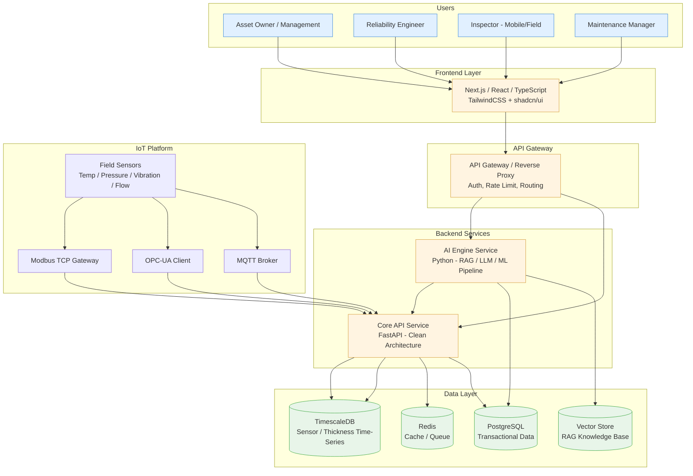
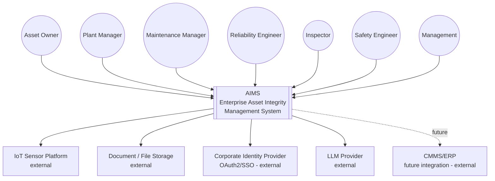
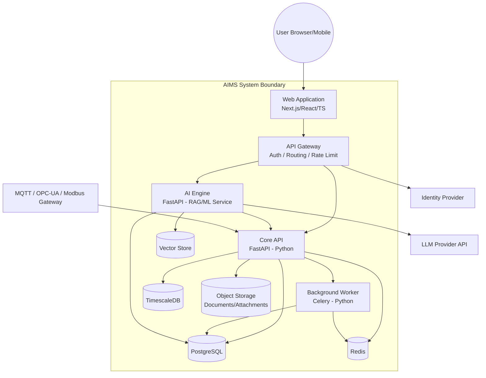
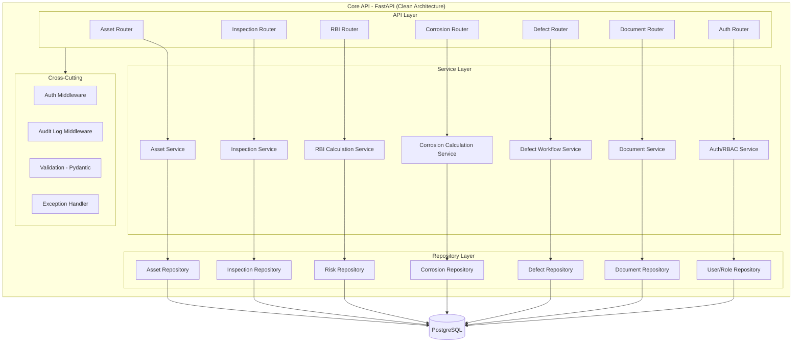
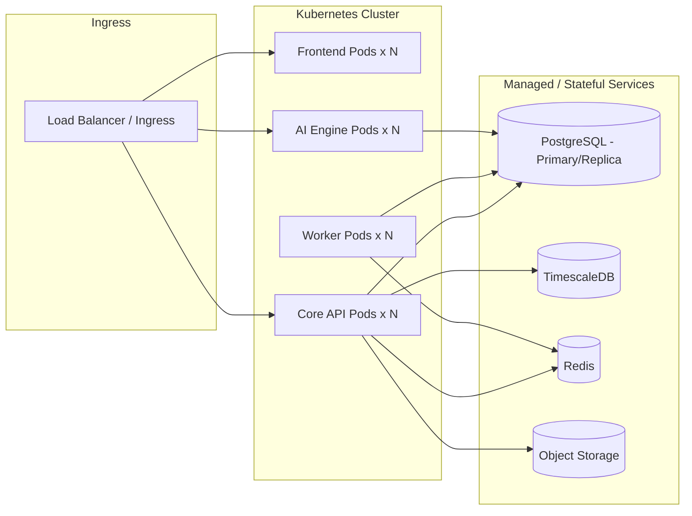

# System Architecture Design
## Enterprise Asset Integrity Management System (AIMS)

| Field | Value |
|---|---|
| Version | 1.0 |
| Status | Draft |
| Date | 2026-08-06 |

---

## 1. Technology Stack Decision

| Layer | Choice | Rationale |
|---|---|---|
| Frontend | Next.js (React, TypeScript), TailwindCSS, shadcn/ui | SSR/SSG for dashboards, strong TS ecosystem, accessible component primitives |
| Backend (Core API) | **FastAPI (Python)** | Native fit with AI/ML/RAG services, async I/O, automatic OpenAPI generation, strong typing via Pydantic |
| Database | PostgreSQL | ACID compliance, mature RBAC/row-level security, JSONB for flexible attributes |
| Time-Series | TimescaleDB (PostgreSQL extension) | Native SQL for sensor/thickness time-series without a separate DB engine |
| Cache/Queue | Redis | Session cache, rate limiting, Celery/task queue broker |
| AI Service | Python (FastAPI microservice), LangChain/LlamaIndex-style RAG, LLM API integration | Isolates AI workload, independent scaling, model-agnostic |
| IoT Ingestion | MQTT broker (Mosquitto/EMQX), OPC-UA client, Modbus TCP gateway | Industry-standard industrial protocols |
| Deployment | Docker, Docker Compose (dev), Kubernetes (prod-ready) | Portable, horizontally scalable |
| Security | OAuth2, JWT, RBAC, Audit Trail | Enterprise SSO compatibility, fine-grained authorization |

> Decision note: FastAPI is chosen over NestJS because the AI Copilot, RBI probabilistic calculations, and
> corrosion-rate/statistical analysis are naturally Python-native workloads; using one language across
> Core API and AI Service reduces cross-team handoff and duplicate data models.

---

## 2. High Level Architecture

---

## 3. C4 Model

### 3.1 Level 1 — System Context

### 3.2 Level 2 — Container Diagram

### 3.3 Level 3 — Component Diagram (Core API)

---

## 4. Deployment Topology (Kubernetes-Ready)

---

## 5. Architecture Principles

1. **Clean Architecture** — Core API separates API/Service/Repository/Domain layers; business logic is framework-independent.
2. **Domain-Driven Modules** — Each business module (Asset, Inspection, RBI, Corrosion, Defect, Document) is a bounded context with its own service/repository set.
3. **Stateless Services** — Core API and AI Engine are stateless and horizontally scalable; state lives in PostgreSQL/TimescaleDB/Redis.
4. **API-First** — All functionality exposed via versioned REST API (OpenAPI 3.0), enabling web, mobile, and third-party integration.
5. **Security by Design** — OAuth2/JWT at the gateway, RBAC enforced at the service layer, audit logging at the data layer.
6. **AI as a Separate Service** — The AI Engine is isolated from the Core API so LLM/RAG workloads scale and fail independently of transactional operations.

---

*Related documents: [BRD.md](../01-Business-Requirement/BRD.md) · Next: [Database.md](../03-Database-Design/Database.md)*
