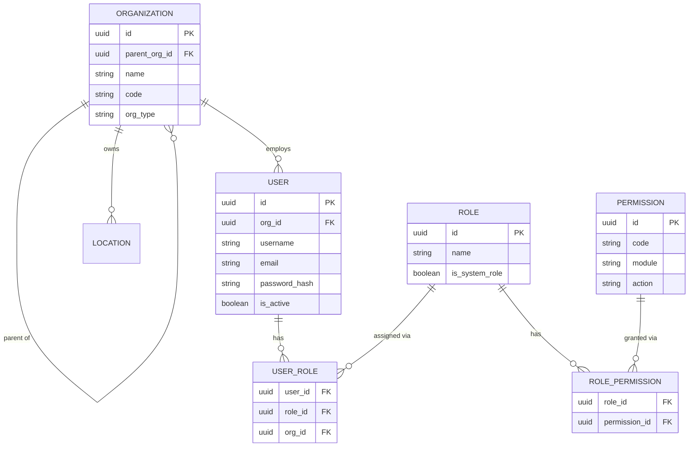
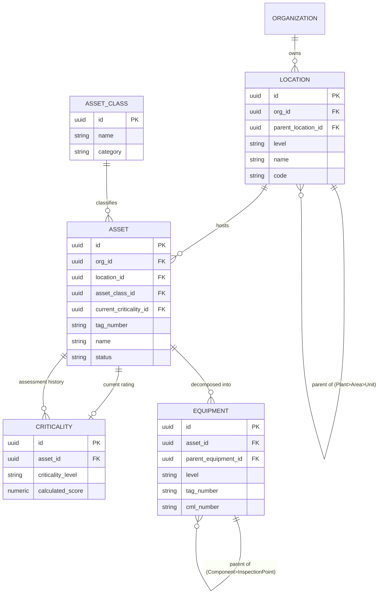
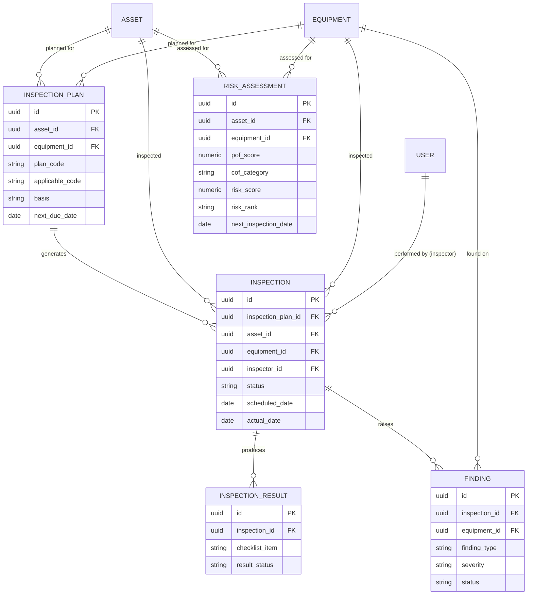
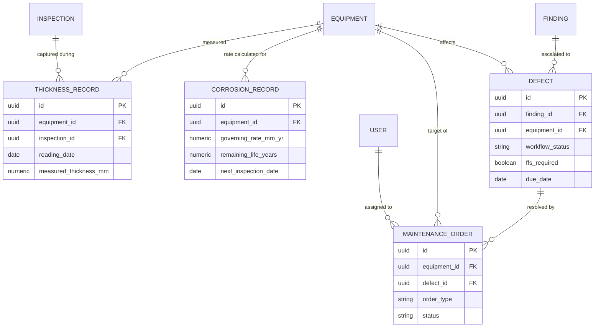
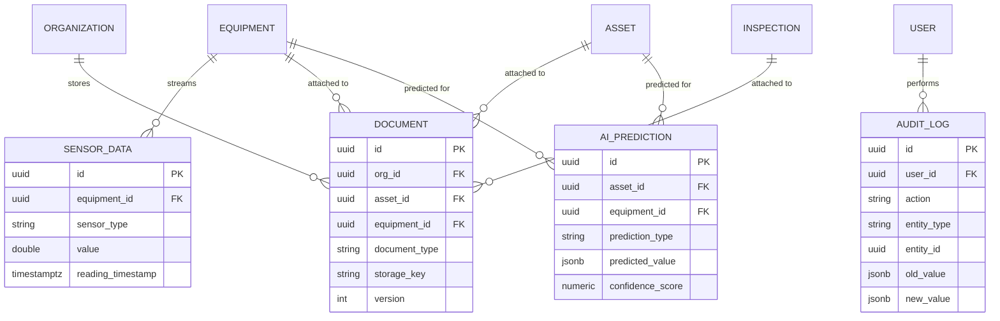

# Entity Relationship Diagram (ERD)
## Enterprise Asset Integrity Management System (AIMS)

Full column-level definitions, indexes, and constraints are in [Database.md](Database.md).
This document shows entity relationships grouped by module.

---

## 1. Identity & Access Management

---

## 2. Asset Hierarchy

---

## 3. Inspection & Risk Based Inspection

---

## 4. Corrosion, Defect & Maintenance

---

## 5. Condition Monitoring, Document, Audit & AI

---

*Related: [Database.md](Database.md) (full column/index/constraint spec) · [DFD.md](../04-Process-Design/DFD.md)*
