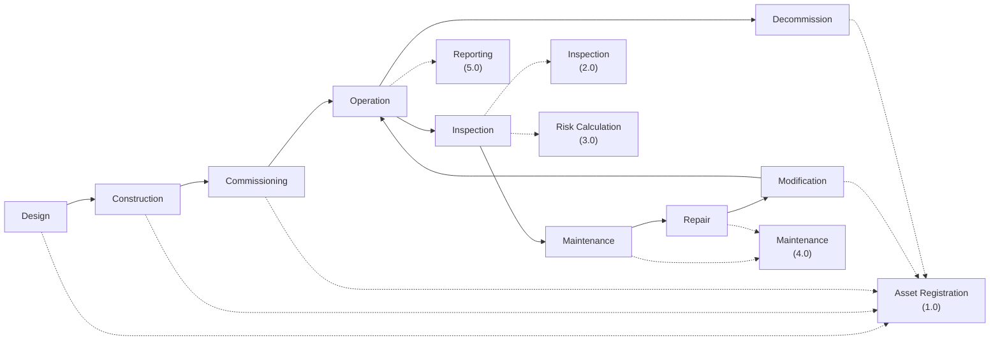

# Business Process Flow
## Enterprise Asset Integrity Management System (AIMS)

This document ties the **Asset Lifecycle** (BRD §2) to the system processes defined in [DFD.md](DFD.md)
and the actor workflows in [Swimlane.md](Swimlane.md).

---

## 1. Asset Lifecycle → System Process Mapping

| Lifecycle Stage | Trigger | Primary Module | Key Records Created |
|---|---|---|---|
| Design | New capital project or asset addition initiated | Asset Management | `asset` (status=Design), `document` (design drawings) |
| Construction | Fabrication/installation begins | Asset Management, Document Management | `document` (construction records, MTRs) |
| Commissioning | Pre-startup checks completed | Asset Management, Inspection | `asset` (status=Commissioning), initial `inspection` (baseline) |
| Operation | Asset placed in service | Condition Monitoring, Dashboard | `sensor_data`, `asset` (status=Operating) |
| Inspection | Inspection plan due date reached / risk-triggered | Inspection Management, RBI | `inspection`, `inspection_result`, `finding`, `thickness_record` |
| Maintenance | Finding/defect requires action | Defect Management | `defect`, `maintenance_order` |
| Repair | Approved repair plan executed | Defect Management, Maintenance | `maintenance_order` (completed), verification `inspection` |
| Modification | Repair changes design basis (e.g. re-rate) | Asset Management | `asset` (design fields updated), `document` (revised P&ID) |
| Decommission | Asset retired from service | Asset Management | `asset` (status=Decommissioned) |

---

## 2. End-to-End Narrative

1. **Asset enters the register** during Design/Construction/Commissioning — Asset Engineer creates the
   `location` → `asset` → `equipment` hierarchy and performs an initial **Criticality Assessment**.
2. **Operation** begins: condition monitoring sensors stream data continuously; the system tracks against
   thresholds and feeds the RBI engine.
3. **Inspection Management** executes scheduled/risk-triggered inspections (see [Swimlane §1](Swimlane.md#1-inspection-workflow)).
   Findings and thickness readings are captured in the field.
4. **RBI** recalculates corrosion rate, remaining life, POF/COF, and risk rank after every inspection cycle
   (see [Swimlane §2](Swimlane.md#2-risk-assessment-workflow)), which in turn updates the next inspection
   interval — closing the risk-based loop.
5. Findings that exceed acceptance criteria become **Defects**, which flow through the **Repair Workflow**
   (see [Swimlane §3](Swimlane.md#3-repair-workflow)): assessment → optional Fitness-For-Service (API 579)
   → approval → repair execution → verification → close.
6. All approval-gated transitions (risk sign-off, repair authorization, document release) follow the shared
   **Approval Workflow** (see [Swimlane §4](Swimlane.md#4-approval-workflow-generic--risk--repair--document)),
   with every decision written to the immutable `audit_log`.
7. **Reporting** continuously aggregates asset, inspection, risk, and defect data into role-based dashboards
   and answers ad hoc questions via the **AI Copilot**.
8. When an asset reaches end-of-life or is replaced, it is moved to **Decommission** status; historical
   inspection/corrosion/document records are retained per NFR-11 for regulatory traceability.

---

*Related: [DFD.md](DFD.md) · [Swimlane.md](Swimlane.md) · [BRD.md](../01-Business-Requirement/BRD.md) · Next: [API-Spec.md](../05-API-Specification/API-Spec.md)*
