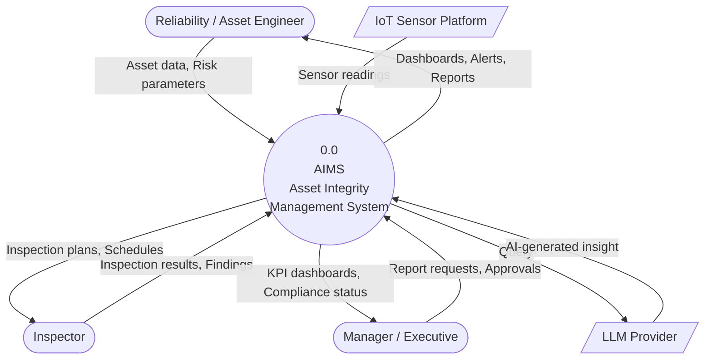
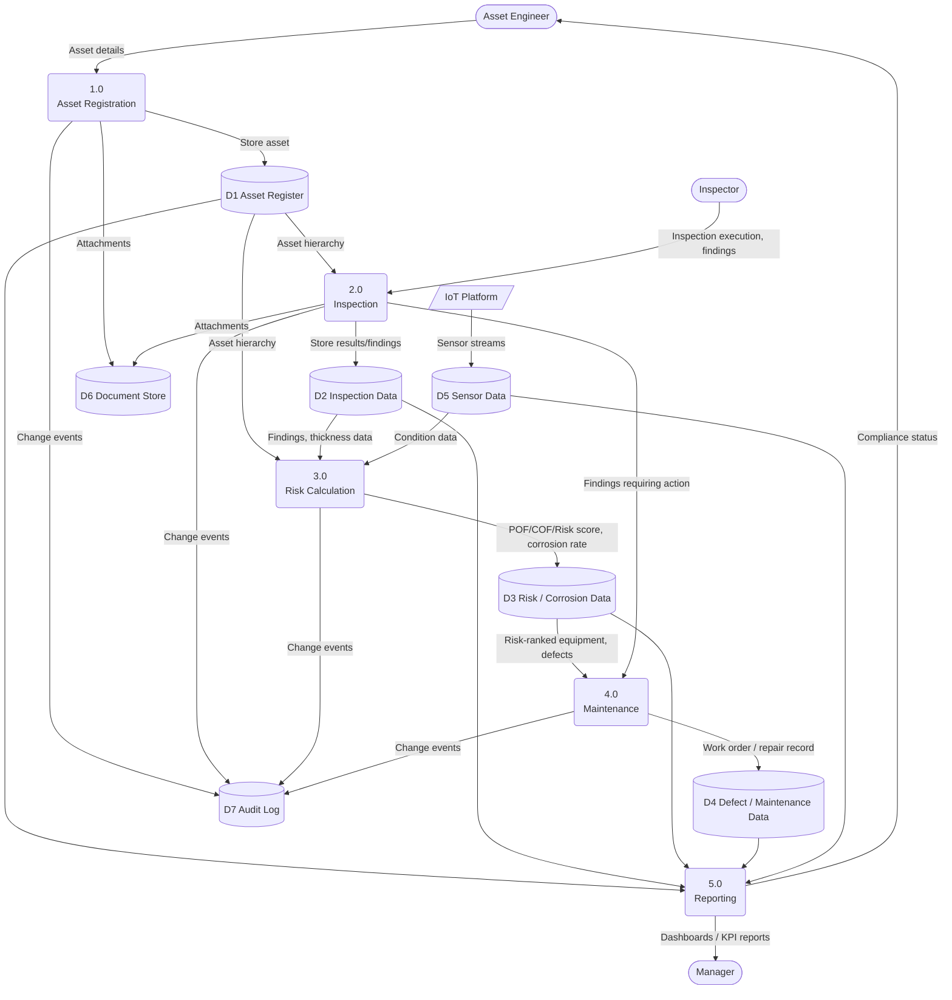
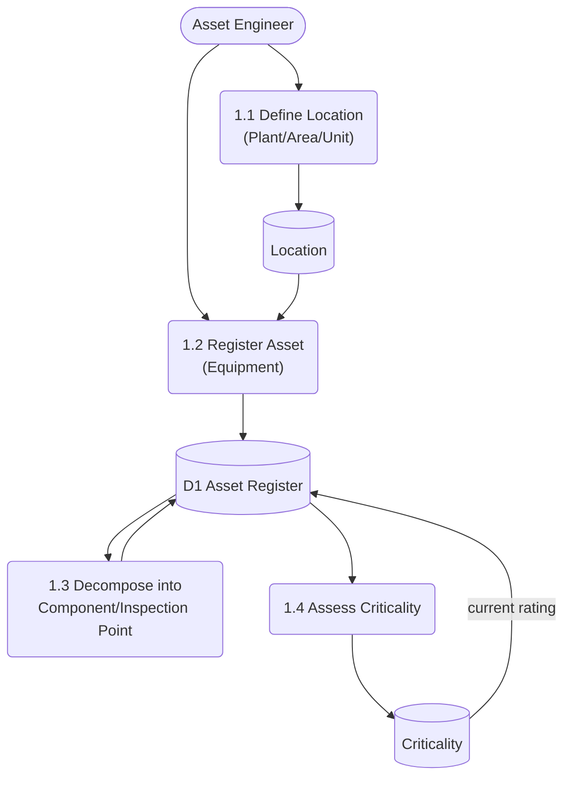
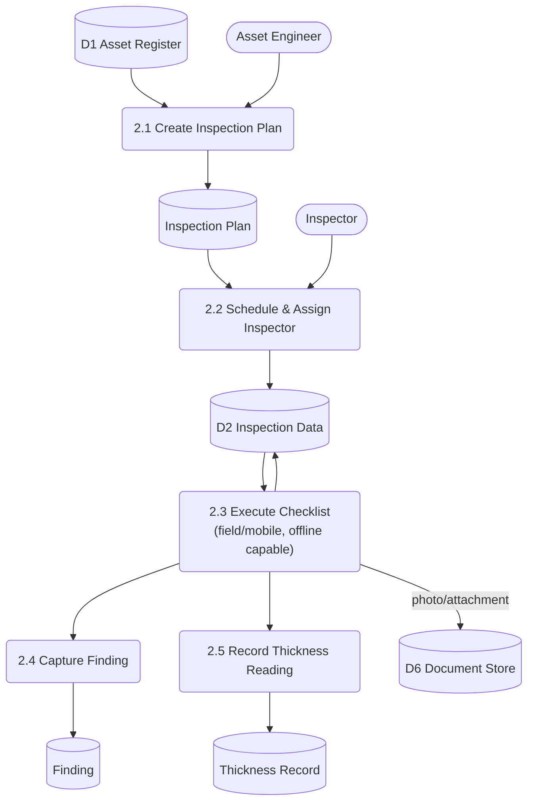
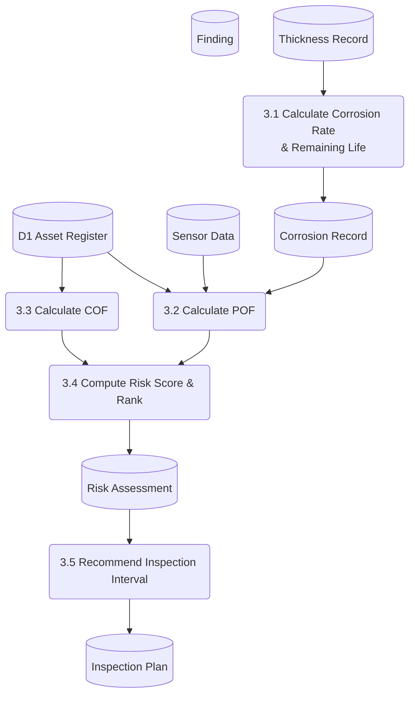
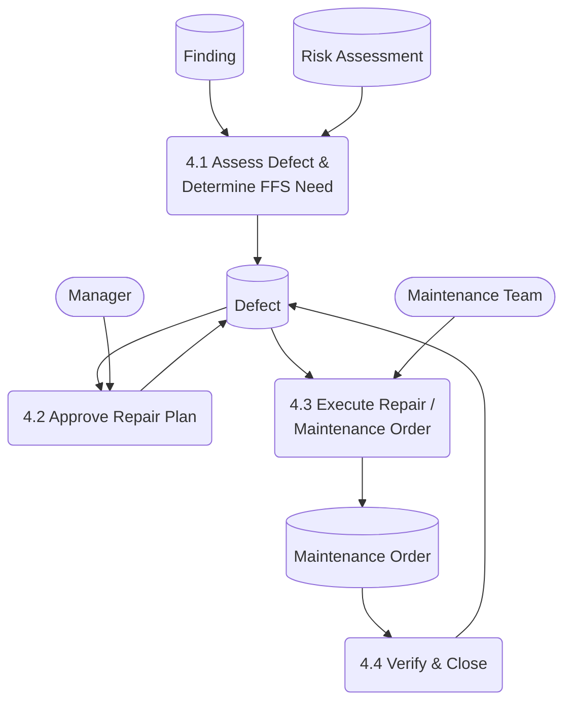
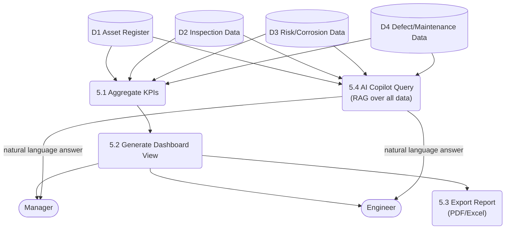

# Data Flow Diagram (DFD)
## Enterprise Asset Integrity Management System (AIMS)

Notation: Rounded rectangles = Process · Rectangles = External Entity · Cylinders = Data Store

---

## Level 0 — Context Diagram

---

## Level 1 — System Process Flow

---

## Level 2 — Detail Process Breakdown

### 2.1 Process 1.0 — Asset Registration

### 2.2 Process 2.0 — Inspection

### 2.3 Process 3.0 — Risk Calculation

### 2.4 Process 4.0 — Maintenance

### 2.5 Process 5.0 — Reporting

---

*Related: [ERD.md](../03-Database-Design/ERD.md) · Next: [Swimlane.md](Swimlane.md)*
