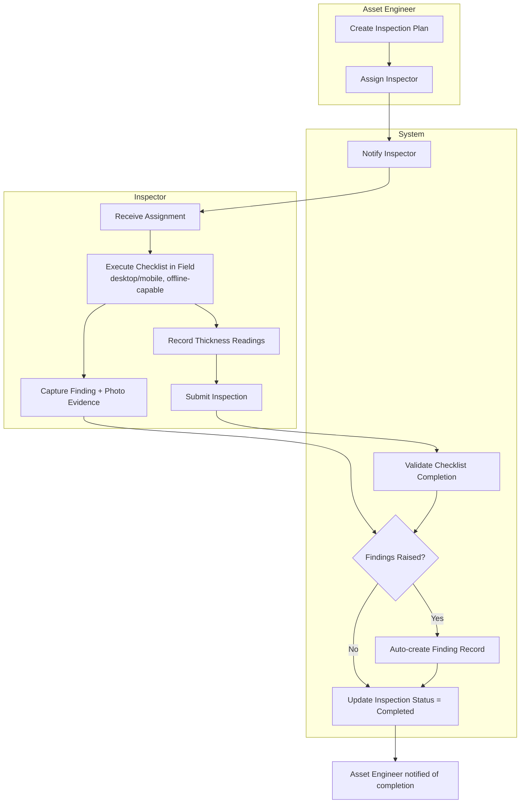
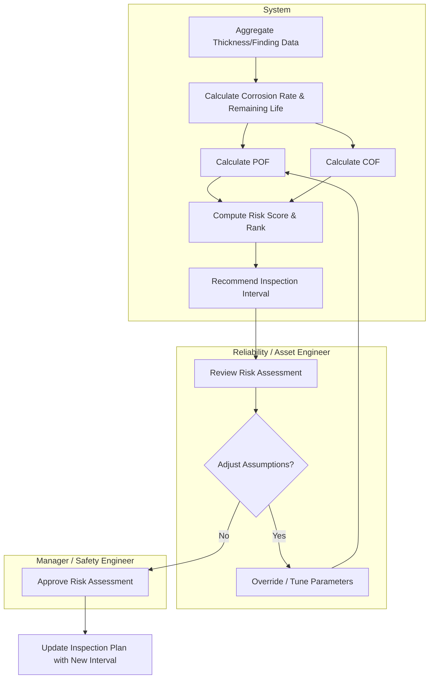
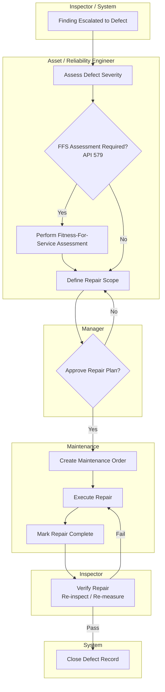
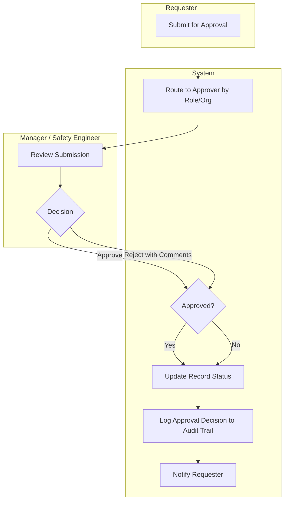

# Business Process Design — Swimlane Diagrams
## Enterprise Asset Integrity Management System (AIMS)

Actors: **Asset Engineer**, **Inspector**, **Maintenance**, **Manager**, **System**

---

## 1. Inspection Workflow

---

## 2. Risk Assessment Workflow

---

## 3. Repair Workflow

---

## 4. Approval Workflow (Generic — Risk / Repair / Document)

---

*Related: [DFD.md](DFD.md) · [BRD.md](../01-Business-Requirement/BRD.md) · Next: [BusinessFlow.md](BusinessFlow.md)*
