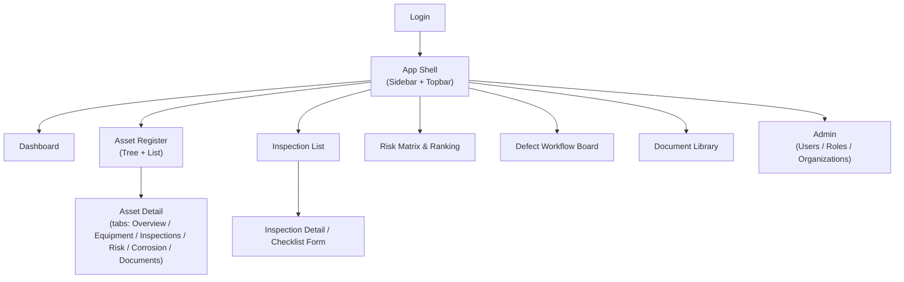

# UI/UX Specification
## Enterprise Asset Integrity Management System (AIMS)

| Field | Value |
|---|---|
| Version | 1.0 |
| Stack | Next.js (App Router) · React · TypeScript · TailwindCSS · shadcn/ui-style components |

---

## 1. Information Architecture

Sidebar navigation groups mirror the BRD modules: **Dashboard, Asset Register, Inspections, Risk (RBI), Defects,
Condition Monitoring, Documents, Admin** — each gated by the current user's `permissions[]` from the JWT.

---

## 2. Design Tokens

Follows a shadcn/ui-style token system (CSS variables in `globals.css`, both light and dark themes):
`--background`, `--foreground`, `--card`, `--primary`, `--muted`, `--destructive`, `--border`, `--radius`.
Severity/risk colors are semantic, not hard-coded: `Low` = green, `Medium` = amber, `High` = orange,
`Critical`/`VeryHigh` = red — defined once in `lib/utils.ts` (`riskColor()`, `severityColor()`) and reused
across badges, the risk matrix, and charts so color meaning stays consistent everywhere.

---

## 3. Key Screens

### 3.1 Dashboard (Executive / Engineering / Inspection views)
- KPI cards row: Asset Availability, Inspection Compliance, Overdue Inspections, Risk Reduction YoY,
  Avg. Remaining Life, Defect Closure SLA (BRD §7 KPIs) — each a stat tile with trend delta.
- Risk distribution donut/bar (assets by `risk_rank`).
- "Inspections due in 30 days" table.
- Role-based: Executive sees org-wide KPIs; Engineering sees risk/corrosion trends; Inspection sees
  their assigned schedule.

### 3.2 Asset Register — Tree + List
- Left panel: collapsible hierarchy tree (Plant → Area → Unit → Equipment → Component → Inspection Point),
  lazy-loaded per node via `GET /locations` and `GET /assets?location_id=`.
- Right panel: data table of assets at the selected node (tag number, class, criticality badge, status),
  filterable/sortable, matching `GET /assets` query params.
- Selecting a row opens **Asset Detail**.

### 3.3 Asset Detail (tabbed)
- **Overview**: identity/design data, current criticality badge, status.
- **Equipment**: component/inspection-point tree scoped to this asset (`GET /assets/{id}/equipment`).
- **Inspections**: history + next due date.
- **Risk**: latest `risk_assessment` + trend sparkline (`GET /assets/{id}/risk-history`).
- **Corrosion**: thickness trend chart per CML + remaining life.
- **Documents**: P&ID/drawing/certificate list.

### 3.4 Inspection List & Detail
- List: filterable by status/inspector/date range, color-coded status badge (Planned/InProgress/
  Completed/Overdue/Cancelled).
- Detail/Checklist Form (**field-usable on mobile/tablet**): sequential checklist items with
  Pass/Fail/NA, remarks, photo attach; a persistent "Add Finding" and "Add Thickness Reading" action;
  "Complete Inspection" primary action gated until required items are answered.
- Offline note: form state is designed to be held in local component state and submitted item-by-item
  (`POST /inspections/{id}/results`) so a flaky field connection doesn't lose the whole session — a full
  offline-sync (service worker/IndexedDB queue) is flagged as a fast-follow, not in this pass.

### 3.5 Risk Matrix
- 5×5 POF (x-axis) × COF (y-axis) grid, cell color by risk band (Low/Medium/High/VeryHigh), cell shows
  count of assets; clicking a cell filters the asset list below to that POF/COF combination.
- Companion ranked table: Top 20 highest-risk assets with `risk_score`, `next_inspection_date`.

### 3.6 Defect Workflow Board
- Kanban columns = `workflow_status` (Finding → Assessment → Approval → Repair → Verification → Closed).
- Cards show equipment tag, severity badge, due date; drag/approve actions call the transition endpoints
  (`PUT /defects/{id}`, `/approve`, `/verify`) — illegal transitions are rejected by the API and surfaced
  as a toast, not silently allowed client-side.

### 3.7 Documents
- Table view grouped by `document_type`, filter by asset; upload flow requests a pre-signed URL,
  uploads directly to object storage, then registers metadata (`POST /documents`).

---

## 4. Responsive / Mobile

| Breakpoint | Layout |
|---|---|
| `< 640px` (mobile) | Sidebar collapses to a bottom/hamburger nav; single-column; Inspection Checklist Form is the primary mobile-optimized screen (large tap targets, sticky submit bar) |
| `640–1024px` (tablet) | Two-column where relevant (e.g., Asset Detail tabs stack above content); inspection form is the primary tablet use case for field inspectors |
| `> 1024px` (desktop) | Full sidebar + multi-column dashboards/tables |

---

## 5. Component Inventory (`components/ui/`)

`Button`, `Card`, `Badge` (status/severity/risk variants), `Input`, `Select`, `Table`, `Tabs` — built as
local Tailwind-styled primitives following shadcn/ui conventions (`cn()` class merging, `cva`-style
variants) so a real `shadcn` CLI install can replace them 1:1 later without touching call sites.

---

*Related: [API-Spec.md](../05-API-Specification/API-Spec.md) · [BRD.md](../01-Business-Requirement/BRD.md) · Source: [10-Source-Code/frontend](../10-Source-Code/frontend/)*
