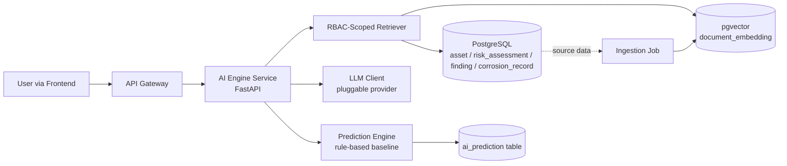

# AI Copilot Module Design
## Enterprise Asset Integrity Management System (AIMS) — AI Engine Service

| Field | Value |
|---|---|
| Version | 1.0 |
| Status | Draft |
| Service | `ai-service` — standalone FastAPI microservice, isolated from Core API (per [Architecture.md](../02-System-Architecture/Architecture.md) §5) |

---

## 1. Scope (Module 10, BRD FR-31/32/33)

| Capability | Endpoint | Approach |
|---|---|---|
| Natural-language Q&A over asset/risk/inspection data | `POST /ai/query` | RBAC-scoped Retrieval-Augmented Generation (RAG) |
| Draft inspection/summary report generation | `POST /ai/reports/generate` | Structured data pull + LLM narrative drafting |
| Predictive failure / remaining-life insight | `GET /ai/predictions/{asset_id}` | Rule-based baseline model, versioned for future ML replacement |

---

## 2. Architecture

The AI service connects **directly to the same PostgreSQL database** as the Core API (read access to
`asset`, `equipment`, `risk_assessment`, `finding`, `corrosion_record`; write access to `ai_prediction`
and `document_embedding`) rather than proxying every read through the Core API — this keeps RAG retrieval
latency low. It never receives or stores credentials; it validates the same JWT issued by the Core API's
`/auth/login`.

---

## 3. RAG Pipeline

1. **Ingestion** (`app/rag/ingestion.py`): a batch job (run on a schedule or after significant data changes)
   summarizes each `asset`/`risk_assessment`/`finding`/`corrosion_record` row into a short text chunk,
   embeds it, and upserts into `document_embedding` (`org_id`, `entity_type`, `entity_id`, `content`,
   `embedding vector(1536)`).
2. **Retrieval** (`app/rag/retriever.py`): hybrid retrieval —
   - Vector similarity search over `document_embedding`, **always filtered by `org_id`** derived from the
     requesting user's JWT (never client-supplied), so a query can never surface another organization's data.
   - A structured fallback query (e.g., "highest risk equipment" maps to `ORDER BY risk_score DESC`) runs
     alongside the vector search so common questions get precise, not just semantically-similar, answers.
3. **Prompt assembly** (`app/llm/prompts.py`): retrieved context + question are assembled into a system
   prompt that instructs the model to answer **only from the supplied context** and cite record IDs, reducing
   hallucination risk.
4. **Generation** (`app/llm/client.py`): an `LLMClient` interface with a real provider implementation
   (Anthropic Claude via the `anthropic` SDK) and a `NullLLMClient` fallback used when no API key is
   configured, so the service still starts and is testable in local/CI environments without network access
   or secrets.

## 4. Embedding Provider Abstraction

Mirrors the LLM client pattern: `EmbeddingProvider` interface with a real provider (`text-embedding-3-small`
class model) and a deterministic `LocalHashEmbedding` fallback for offline development — never a network
call unless an API key is present. Swapping providers is a config change, not a code change.

## 5. Prediction Engine (FR-33)

No labeled failure-history dataset exists yet to train a supervised model, so v1 implements a **transparent
rule-based baseline**: combines the asset's latest `risk_score` and `corrosion_record.remaining_life_years`
into a failure-risk estimate and confidence score, and persists it to `ai_prediction` with
`model_version="rule-based-v1"`. The table's `model_version` and `input_features` (JSONB) columns exist
specifically so a future trained model can be swapped in — same table, same API contract — without a schema
migration.

## 6. Security

- Every retrieval and prediction call is scoped by `org_id` from the JWT — enforced in the query layer, not
  just the prompt, so no amount of prompt injection in a user's question can widen visibility beyond their
  own role/org's data (see [API-Spec.md §13](../05-API-Specification/API-Spec.md#13-ai-copilot)).
- The LLM only ever sees retrieved context strings, never raw DB credentials or unrelated tables.
- `POST /ai/query` responses include `sources` (entity type + id) so answers are traceable back to the
  underlying records for audit purposes.

## 7. Schema Addition

`document_embedding` is a new table (not in the original 22-table [Database.md](../03-Database-Design/Database.md)
list) required to support RAG — added here rather than retrofitted into Phase 2 to keep this design change
traceable to the module that needed it:

| Column | Type | Constraint |
|---|---|---|
| id | UUID | PK |
| org_id | UUID | FK → organization(id), NOT NULL |
| entity_type | VARCHAR(50) | NOT NULL (Asset / RiskAssessment / Finding / CorrosionRecord) |
| entity_id | UUID | NOT NULL |
| content | TEXT | NOT NULL — the summarized source text |
| embedding | VECTOR(1536) | NOT NULL (pgvector extension) |
| created_at | TIMESTAMPTZ | DEFAULT now() |

Indexes: `idx_embedding_org (org_id)`, `idx_embedding_entity (entity_type, entity_id)`,
IVFFlat/HNSW index on `embedding` for approximate nearest-neighbor search.

---

*Related: [Architecture.md](../02-System-Architecture/Architecture.md) · [API-Spec.md](../05-API-Specification/API-Spec.md) · [Backend-Design.md](Backend-Design.md) · Source: [10-Source-Code/ai-service](../10-Source-Code/ai-service/)*
