# Deployment
## Enterprise Asset Integrity Management System (AIMS)

| Field | Value |
|---|---|
| Version | 1.0 |
| Status | Draft |
| Date | 2026-08-06 |

---

## 1. Environments

| Environment | Purpose | Orchestration |
|---|---|---|
| Local Dev | Feature development | `docker compose up` ([docker-compose.yml](../10-Source-Code/docker/docker-compose.yml)) |
| CI | Automated build/test on every push/PR | GitHub Actions ([.github/workflows/ci.yml](../.github/workflows/ci.yml)) |
| Staging / UAT | SIT and UAT execution (see [TestPlan.md](../08-Test-Plan/TestPlan.md)) | Kubernetes (namespace `aims-staging`) |
| Production | Live system | Kubernetes (namespace `aims-prod`), per [Architecture.md §4](../02-System-Architecture/Architecture.md#4-deployment-topology-kubernetes-ready) |

Docker Compose is the local/dev topology; Kubernetes is the target for staging/production, matching the
container images built from the same Dockerfiles in both cases (`docker-compose.yml` and the K8s manifests
reference the identical `backend`, `frontend`, and `ai-service` images — no dev/prod image drift).

## 2. Local Stack (Docker Compose)

```bash
cd 10-Source-Code/docker
cp .env.example .env   # fill in secrets before first run
docker compose up --build
```

| Service | Image / Build | Port | Notes |
|---|---|---|---|
| `frontend` | `../frontend` (Next.js) | 3000 | `NEXT_PUBLIC_API_BASE_URL` points at `backend` |
| `backend` | `../backend` (FastAPI Core API) | 8000 | Runs Alembic migrations on startup (see §3) |
| `ai-service` | `../ai-service` (FastAPI AI Engine) | 8001 | Isolated from `backend`; shares the same database |
| `postgres` | `timescale/timescaledb-ha:pg16` | 5432 | Bundles TimescaleDB + pgvector; `init-db.sql` enables both extensions on first boot |
| `redis` | `redis:7-alpine` | 6379 | Cache / session support |
| `mosquitto` | `eclipse-mosquitto:2` | 1883 | MQTT broker for IoT sensor ingestion (FR-24) |

No API Gateway container is included in the Compose topology — for local/dev, the frontend calls `backend`
and `ai-service` directly. In staging/production, gateway concerns (routing, rate limiting, TLS
termination) are handled by the Kubernetes Ingress controller, matching [Architecture.md §2](../02-System-Architecture/Architecture.md#2-high-level-architecture)'s
logical API Gateway layer without a redundant extra hop in local dev.

## 3. Database Migrations (Alembic)

Two services own migrations independently, each for the tables it writes to:

| Service | Owns | Migration Path |
|---|---|---|
| `backend` | The 22 core tables in [Database.md](../03-Database-Design/Database.md) (`organization`, `user`, `asset`, `inspection`, `risk_assessment`, … `audit_log`) | `10-Source-Code/backend/migrations/` |
| `ai-service` | `ai_prediction`, `document_embedding` (added in [AI-Copilot-Design.md §7](../07-Backend-Design/AI-Copilot-Design.md#7-schema-addition)) | `10-Source-Code/ai-service/migrations/` |

`ai-service`'s Alembic `env.py` filters `include_object` to only its two owned tables — it imports the
backend's models for read access (`app/core/read_models.py`) but must never generate a migration that
tries to create/alter tables the backend already owns.

```bash
# Generate a new migration after changing models (run from the owning service's directory)
alembic revision --autogenerate -m "describe the change"
alembic upgrade head
```

`postgres`'s `init-db.sql` runs once, before any Alembic migration, to `CREATE EXTENSION IF NOT EXISTS timescaledb`
and `CREATE EXTENSION IF NOT EXISTS vector` — both migrations assume these extensions already exist.

## 4. CI/CD Pipeline

```mermaid
flowchart LR
    Git[Git Push / PR] --> Build[Build]
    Build --> Test[Test]
    Test --> Deploy[Deploy]

    subgraph Build
        B1[backend: pip install]
        B2[frontend: npm ci]
        B3[ai-service: pip install]
    end
    subgraph Test
        T1[backend: pytest]
        T2[frontend: tsc --noEmit + next build]
        T3[ai-service: import / mapper smoke test]
        T4[security: pip-audit / npm audit]
    end
    subgraph Deploy
        D1[Build & push Docker images]
        D2[Apply K8s manifests to staging]
        D3["Manual approval gate"]
        D4[Apply K8s manifests to production]
    end

    Test --> D1 --> D2 --> D3 --> D4
```



Implemented in [.github/workflows/ci.yml](../.github/workflows/ci.yml): `build-and-test-backend`,
`build-and-test-frontend`, and `build-and-test-ai-service` run in parallel on every push/PR. A `deploy`
job (image build + push) runs only on `main` after all three pass, gated behind a required manual approval
before production (Deploy §D3/D4) — image push does not imply a live rollout.

## 5. Configuration & Secrets

| Concern | Approach |
|---|---|
| Secrets (`JWT_SECRET_KEY`, `ANTHROPIC_API_KEY`, DB credentials) | Never committed; injected via `.env` locally (gitignored) and Kubernetes `Secret` objects in staging/production |
| Config drift between `backend` and `ai-service` JWT settings | Both must share `JWT_SECRET_KEY`/`JWT_ALGORITHM` — sourced from the same K8s `Secret` in both deployments |
| CORS origins | `CORS_ORIGINS` env var per environment (see [SecurityTest.md SEC-016](../08-Test-Plan/SecurityTest.md#6-api-security)) — never `*` outside local dev |

## 6. Rollback

- **Application**: Kubernetes rolling deployments retain the previous ReplicaSet — `kubectl rollout undo` reverts instantly.
- **Database**: Alembic migrations are written to be reversible (`downgrade()`); a rollback that requires a
  schema downgrade is a deliberate, reviewed action, not automated as part of the deploy pipeline.
- **Frontend**: Static build artifacts are versioned per image tag — the Ingress can be pointed at the prior tag.

## 7. Health & Readiness

Both `backend` and `ai-service` expose `GET /health` (see their `main.py`), used as the Kubernetes
liveness/readiness probe target and the Compose `healthcheck` for startup ordering.

---

*Related: [Architecture.md](../02-System-Architecture/Architecture.md) · [TestPlan.md](../08-Test-Plan/TestPlan.md) · Source: [10-Source-Code/docker](../10-Source-Code/docker/)*
